#  Typora Markdown

### 1.#代表标题

### 2. ~~删除线~~

### 3. *斜体*

### 4. **加粗**

### 5.***斜体加粗***

### 6. <u>下划线</u>(command + u快捷键)

### 7.高亮(==需勾选扩展语法==)

### 8.下标(==需勾选扩展语法==)  H~2~O~2~

### 9.上标(==需勾选扩展语法==) m^2^

### 10. 表情符号

:smile::laughing::cry::100:

### 11.表格(command + option + t快捷捷)

| name | price | tag |
| :---- | :-----: | ----: |
| aaaa | 10    | h |

### 12. 引用

> 不知妻美刘强东
>
> >  

### 13. 无序列表

* 村
* 长

### 14.有序列表

1. 村
2. 长

### 15. 代码

####15.1 代码块

~~~markdown
```语言名称
~~~

#### 15.2 行内代码

` java` `c` `JavaScript`

#### 15.3 转换规则

### 16.分割线

***

-----

### 17.跳转

#### 17.1 外部超链接

[百度]( http://www.baidu.com)

#### 17.2 内部超链接(Only Typora support)

[我想跳转](#20.饼图(Pie))

#### 17.3 自动链接

<http://www.baidu.com>

### 18. 图片

#### 18.1 网上图片


#### 18.2 本地图片


### 19 Markdown画图(==需勾选扩展语法==)

| 用词 | 含义     |
| ---- | -------- |
| TB   | 从上到下 |
| BT   | 从下到上 |
| RL   | 从右到左 |
| LR   | 从左到右 |

> T = Top, B = Bottom,  L = Left,  R = Right

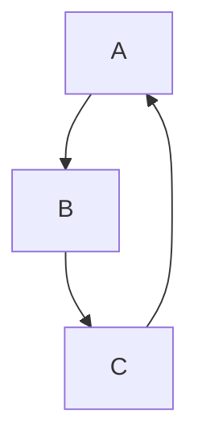

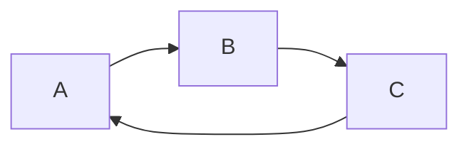

#### 19.1 流程图常用的符号及含义

| 表述       | 说明         | 含义                                               |
| ---------- | ------------ | -------------------------------------------------- |
| id[文字]   | 矩形节点     | 表示过程, 也就是整个流程中的一个环节               |
| id(文字)   | 圆角矩形节点 | 表示开始和结束                                     |
| id((文字)) | 圆形节点     | 表示连接,为避免流程过程过长或交叉,可将流程切开成对 |
| id{文字}   | 菱形节点     | 表示判断和决策                                     |
| id> 文字]  | 右向旗帜节点 |                                                    |

~~~ mermaid
graph TB;
 	A
 	B(圆角节点)
 	C[矩形节点]
 	D((圆形节点))
 	E{菱形节点}
 	F>右向旗帜节点]
~~~

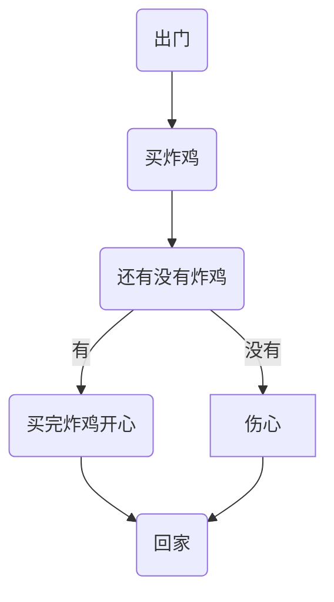

#### 19.2 连线

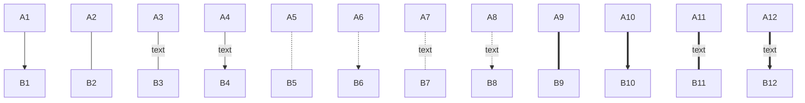

#### 19.3 子表图


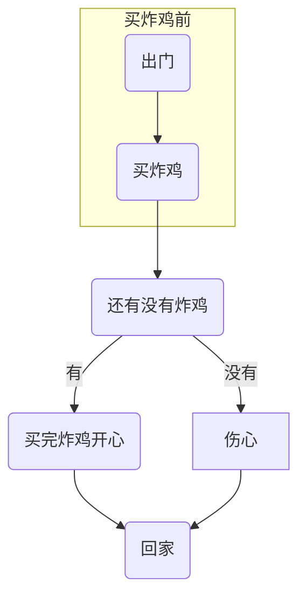

#### 19.4 序列图

~~~ mermaid
sequenceDiagram
	Title:买炸鸡
	Brody->>炸鸡店小姐姐:还有炸鸡吗?
	炸鸡店小姐姐-->> Brody:没有,要现炸
~~~


#### 19.4 参与者

~~~ mermaid
sequenceDiagram
	participant Liao
	participant lcj
	participant bbliao
	
~~~

#### 19.5 消息线


| 类型 | 描述                       |
| ---- | -------------------------- |
| ->   | 无箭头的实线               |
| -->  | 无箭头的虚线               |
| ->>  | 有箭头的实线(主动发现消息) |
| -->> | 有箭头的虚线(响应)         |
| -x   | 末端为叉的实线(表示异步)   |
| --x  | 末端为叉的虚线(表示异步)   |

#### 19.6 处理中激活框

~~~ mermaid
sequenceDiagram
	participant B as Brody
	participant seller as 炸鸡店小姐姐
	B ->> seller: 还有炸鸡吗?
	seller -->> B:没有,要现炸
	B -x +seller: 给我炸
	seller -->> -B:炸好了
~~~

#### 19.7 注解

| 表述     | 含义                      |
| -------- | ------------------------- |
| right of | 右则                      |
| left of  | 左则                      |
| over     | 在当中,可以横跨多个参与者 |


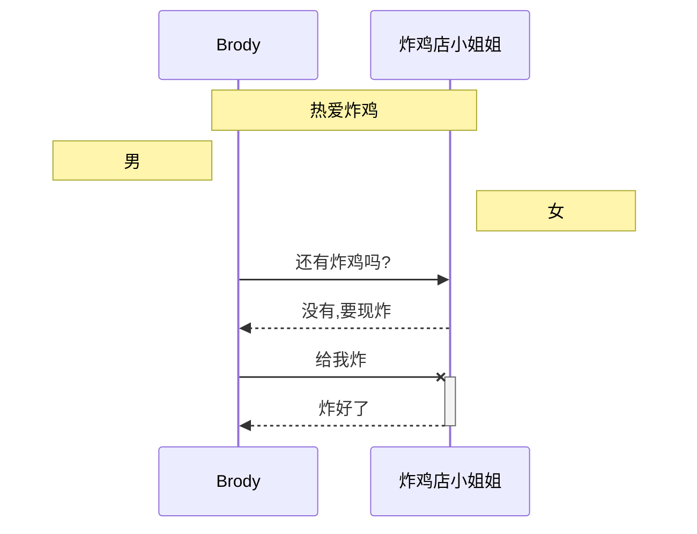

#### 19.8 循环

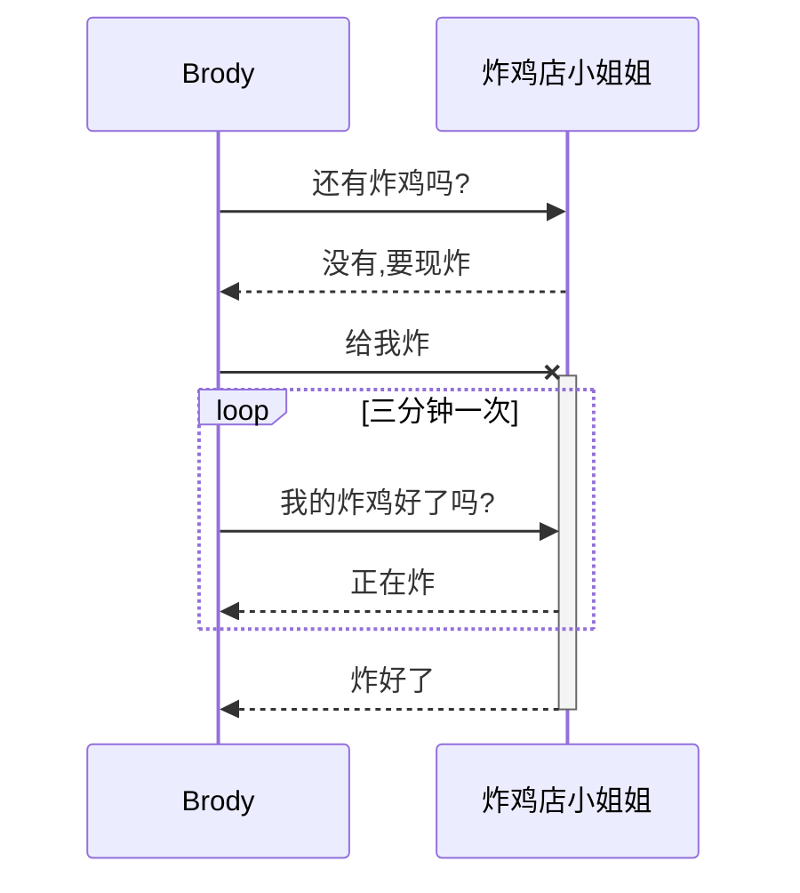

### 19.9 选择( alt)

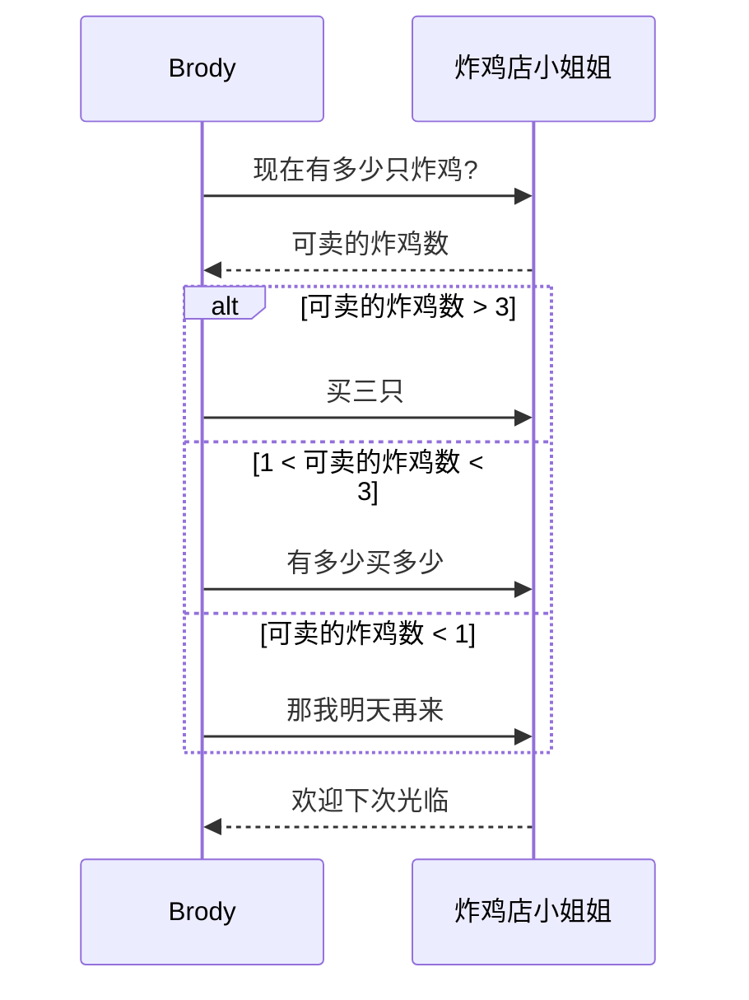

#### 19.10 选项( opt)

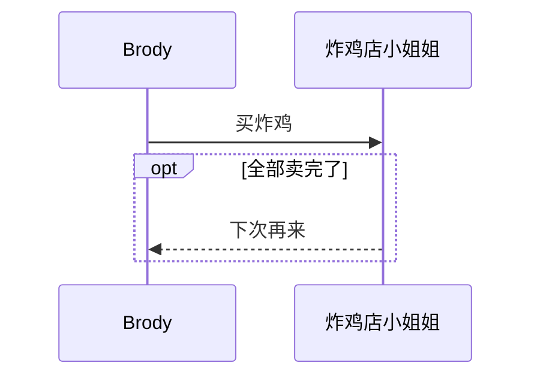


#### 19.11 并行( par)

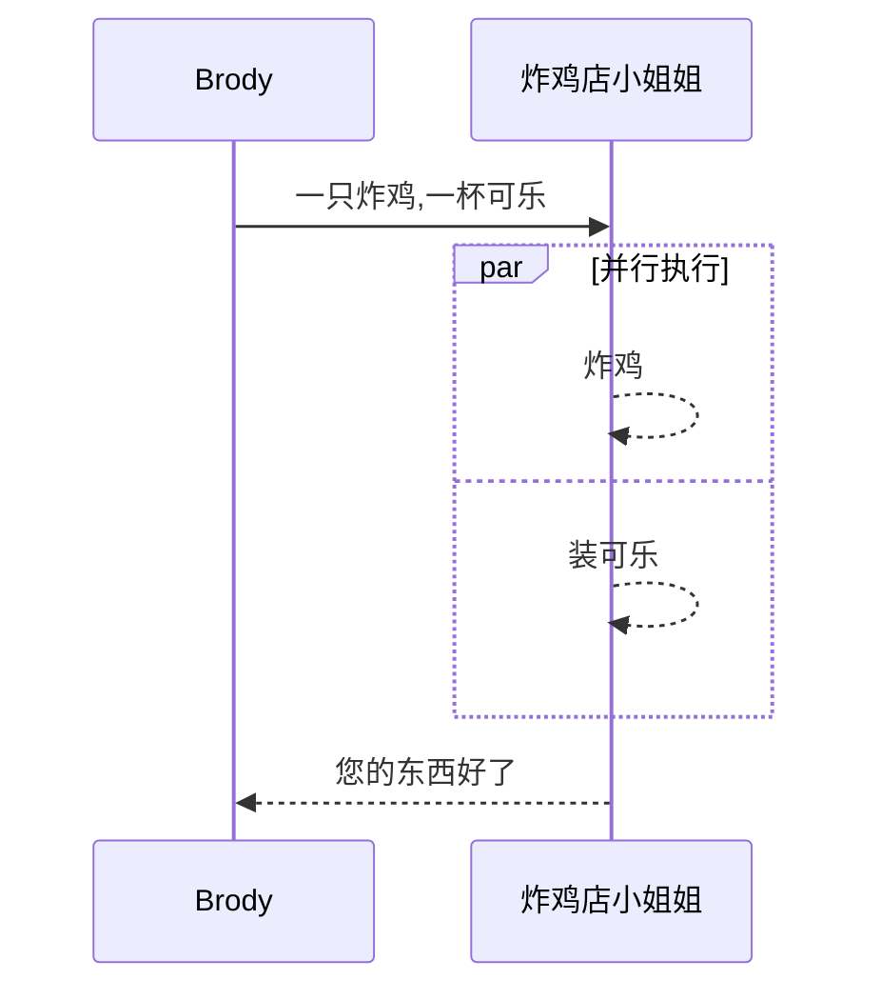

### 20.饼图(Pie)

~~~ mermaid
pie
	title Pie Chart
	"Dogs": 386
	"Cats": 85
	"Rates": 150
~~~

### 21.甘特图(gantt)

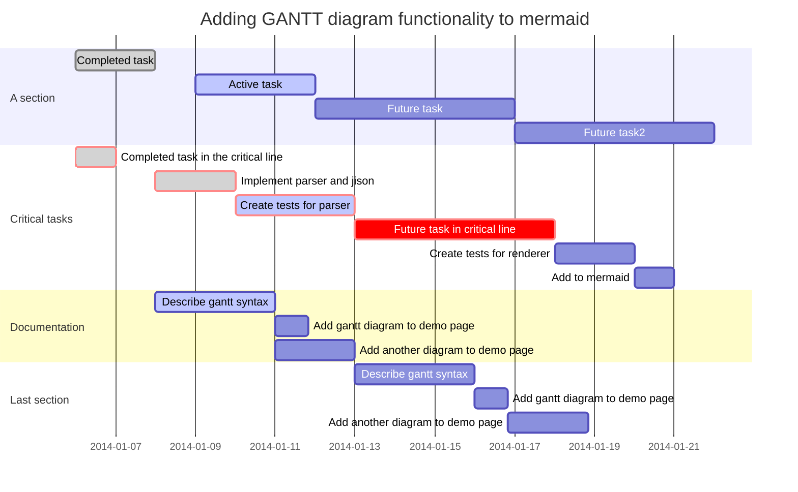

###  

### 22.类图( class)

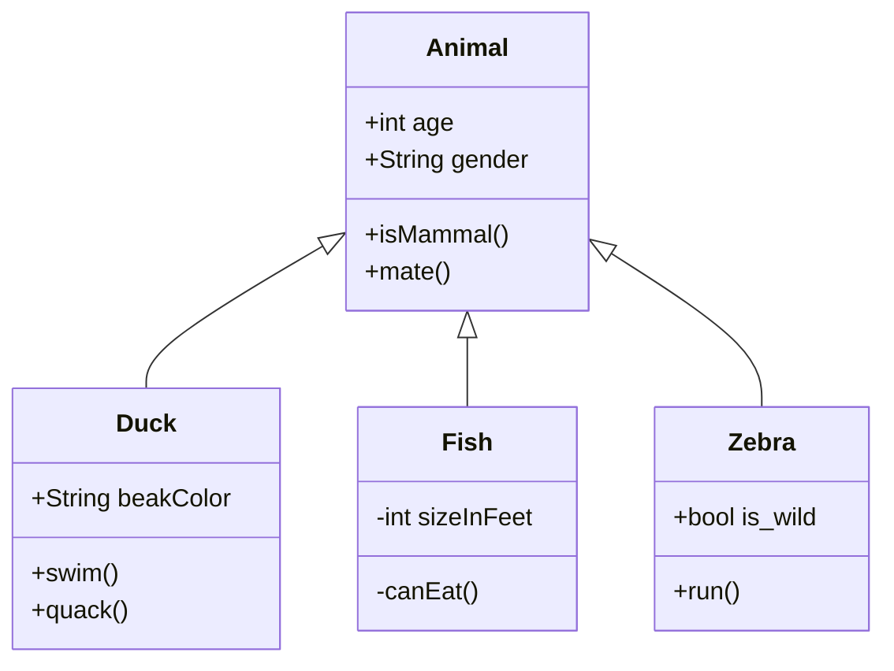

### 23.状态(state)

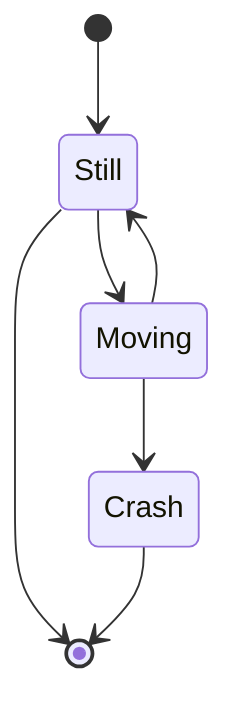

### 24.流程图(flow)

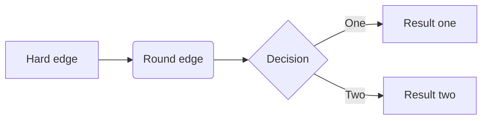

```flow
st=>start: Start
op=>operation: Your Operation
cond=>condition: Yes or No?
e=>end

st->op->cond
cond(yes)->e
cond(no)->op
```

### 25.数学与学术功能

#### 25.1 数学块

$$
\begin{align*}
y = y(x,t) &= A e^{i\theta} \\
&= A (\cos \theta + i \sin \theta) \\
&= A (\cos(kx - \omega t) + i \sin(kx - \omega t)) \\
&= A\cos(kx - \omega t) + i A\sin(kx - \omega t)  \\
&= A\cos \Big(\frac{2\pi}{\lambda}x - \frac{2\pi v}{\lambda} t \Big) + i A\sin \Big(\frac{2\pi}{\lambda}x - \frac{2\pi v}{\lambda} t \Big)  \\
&= A\cos \frac{2\pi}{\lambda} (x - v t) + i A\sin \frac{2\pi}{\lambda} (x - v t)
\end{align*}
$$

#### 25.2 行内数学

$\lim_{x \to \infty } \exp(-x) = 0$


#### 25.3 化学公式

$\ce{CH4 + 2 $\left( \ce{O2 + 79/21 N2} \right)$}$

#### 25.4 数学


Here is a labeled equation:

$$
x+1\over\sqrt{1-x^2}\label{ref1}\tag{1}
$$

This is a reference : $\ref{ref1}$


